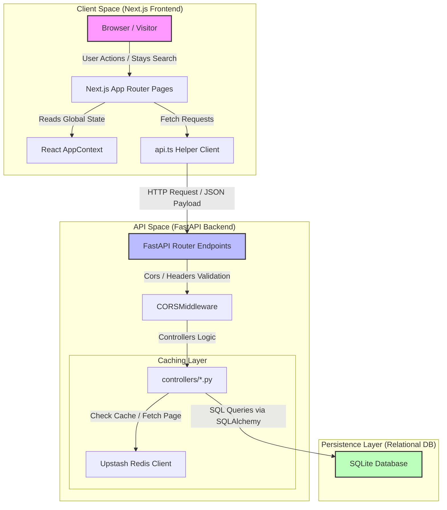
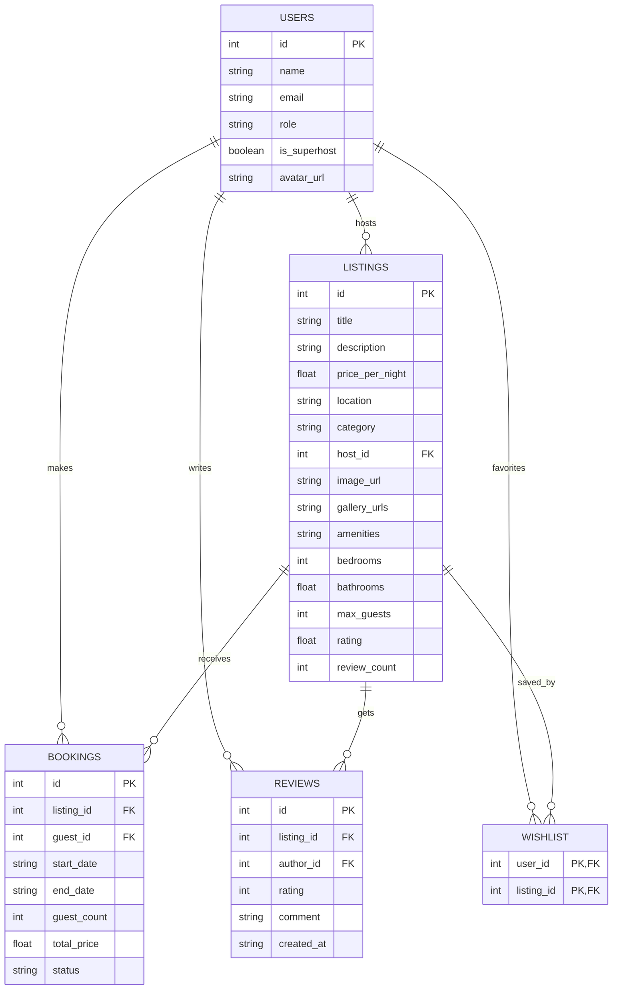

# Fullstack Airbnb Clone

A fully functional clone of the Airbnb marketplace web application. It replicates Airbnb's clean aesthetics, booking workflows, and user experiences, complete with interactive maps and a host dashboard.

---

## Detailed Project Architecture

The architecture separates concerns between a stateless FastAPI backend and a stateful Next.js frontend, utilizing SQLite for relational data persistence.

### High-Level Architecture Flow Diagram



### Folder Architecture Structure
```
airbnb-web-app/
├── backend/
│   ├── app/
│   │   ├── controllers/      # Database queries, updates, and Redis caching invalidation logic
│   │   ├── db/               # SQLAlchemy engine configuration and models definitions
│   │   ├── routers/          # RESTful FastAPI route schemas and handlers
│   │   ├── utils/            # Shared date calculation and formatting utility functions
│   │   ├── main.py           # FastAPI entry point, CORS config, and route inclusions
│   │   ├── schemas.py        # Pydantic input/output schemas for payloads validation
│   │   └── seed.py           # SQLite db tables creator and sample data seed generator
│   └── requirements.txt      # Python requirements (LibSQL, FastAPI, Uvicorn, Upstash Redis)
│
├── frontend/
│   ├── src/
│   │   ├── app/              # Next.js pages (Explore, Detail Stays, Trips History, Host Dashboard)
│   │   ├── components/       # Modular UI components (Review Modals, Listing Cards, Leaflet Maps)
│   │   ├── context/          # React AppContext (tracks search query, auth roles switcher, toast notifications)
│   │   ├── utils/            # Centralized API fetch wrapper client
│   │   └── styles/           # CSS design variables and custom Tailwind overrides
│   ├── vercel.json           # Vercel deployment blueprint config
│   └── package.json          # Node dependencies list
```

---

## Database Schema Design

I designed a clean, normalized relational database structure to represent properties, reservations, and customer reviews.

### Database Schema Model Diagram



### Table Details
1. **users**: Represents application profiles. Distinguishes role types ("guest" vs "host").
2. **listings**: Accommodations posted by hosts. Includes metadata and aggregates like rating and review_count updated dynamically on review submission.
3. **bookings**: Stays booked by guests. Validated to prevent overlapping reservations.
4. **reviews**: Stays reviews submitted by guests.
5. **wishlist**: Stores favorited listings per user.

---

## Key Code Design Patterns

### 1. Optimistic UI Updates
When saving a listing to your Wishlist, the UI changes the heart icon status instantly (0ms delay) and throws a success toast. The API sync occurs in the background. If the server fails, it rolls back to the previous state automatically:
```typescript
const previousFavorites = [...favorites];
// Instantly update UI state
setFavorites(prev => isFav ? prev.filter(id => id !== listingId) : [...prev, listingId]);

try {
  if (isFav) await api.wishlist.remove(listingId, currentUserId);
  else await api.wishlist.add(listingId, currentUserId);
} catch (error) {
  // Rollback on server failure
  setFavorites(previousFavorites);
}
```

### 2. Upstash Redis Caching & Invalidation
To minimize slow database queries, the listing details GET request is cached in Upstash Redis. When a host modifies their listing, or a guest adds a review, the cache for that listing is instantly invalidated to keep data consistent.

### 3. Account Switcher (Demo Tool)
In the top-right profile menu, you can instantly change active users. This lets you switch between Alex Mercer (Guest) and Sarah Jenkins (Host) to test the complete booking workflow (creating listing -> booking it -> viewing the trips) in a single browser window for demonstration purposes.

---

## Tech Stack Breakdown

- **Next.js (React 19 + TypeScript)**: Fast page load speeds and Catch type errors during compiling.
- **FastAPI (Python)**: Auto-generated interactive Swagger API documentation (/docs) and rapid execution.
- **SQLite (SQLAlchemy ORM)**: Lightweight relational storage stored locally (airbnb.db), easily connectable to hosted Turso serverless SQL.
- **Tailwind CSS**: Simple class overrides to replicate Airbnb's custom card spacing, rounded modals, and font styles.
- **Leaflet & OpenStreetMap**: Interactive map component mapping listing pins to coordinate points.

---

## How to Setup and Run Locally

### 1. Setup Backend (FastAPI & SQLite)
```bash
# Move to backend folder
cd backend

# Create virtual environment
python3 -m venv venv
source venv/bin/activate # Windows: venv\Scripts\activate

# Install dependencies
pip install -r requirements.txt

# Seed the database (Creates tables and populates dummy data)
python -m app.seed

# Launch server
uvicorn app.main:app --host 0.0.0.0 --port 8000
```
API endpoints are now interactive at http://localhost:8000/docs.

### 2. Setup Frontend (Next.js)
```bash
# Move to frontend folder (in a new terminal window)
cd frontend

# Install packages
npm install

# Run dev mode
npm run dev
```
The client dashboard launches at http://localhost:3000.

---

## Deployment Configurations

* **Backend (Render)**: Set the root directory to backend, use pip install -r requirements.txt as build command, and python -m app.seed && uvicorn app.main:app --host 0.0.0.0 --port $PORT as start command. Configured via the workspace render.yaml blueprint.
* **Frontend (Vercel)**: Set the root directory to frontend and register NEXT_PUBLIC_API_URL environment variable pointing to your deployed Render instance.
